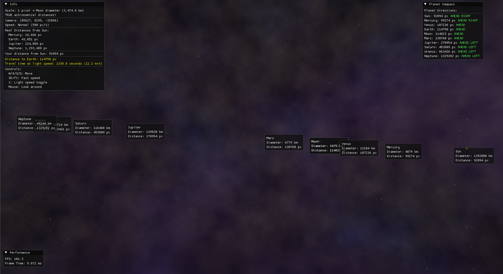

# If the Moon Were Only One Pixel: 3D Interactive Solar System

*Demo: Visualization of the solar system using a true Moon-diameter-per-pixel scale and light-speed simulation*

This project is inspired by [Josh Worth's "If the Moon Were Only 1 Pixel"](https://joshworth.com/dev/pixelspace/pixelspace_solarsystem.html), which beautifully depicts the incomprehensible scale of our solar system—using a single pixel to represent the Moon's true diameter (1 pixel = 3,474.4 km). While that work offered a 2D, scrollable perspective on cosmic distances, this project takes the concept further into a fully interactive and immersive 3D experience.

## Purpose

The goal is to help users truly appreciate the vastness of space between celestial objects by bringing the "moon-as-a-pixel" concept into three dimensions. This visualization lets you see, navigate, and interact with our solar system at a highly accurate scale—using true distances (1 pixel = 3,474.4 km) and simulating travel at the speed of light. Explore, travel to planets, and experience the vast emptiness of space firsthand.

## Acknowledgements

- Inspired by Josh Worth’s [Pixel Space Solar System](https://joshworth.com/dev/pixelspace/pixelspace_solarsystem.html).
- This 3D project builds on the core idea of mapping cosmic scales to relatable sizes, making them explorable in a far richer, interactive context.

## NOTE

- This project is now at version 1.0 and is ready.

## Future Plans

More things will be added in the future—and maybe, you'll even be able to travel to new places or things!

Contributions and suggestions are welcome as the project continues to evolve!